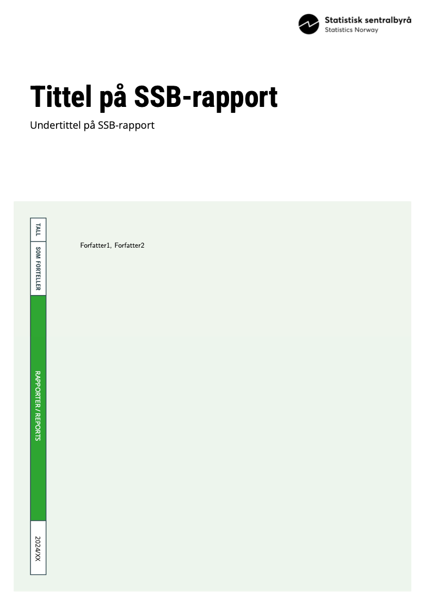

# Quarto-template for an SSB report (WIP)

This repository contains a template for creating SSB-reports (SSB Rapport) with [Quarto](https://quarto.org/). This enables users to write reports from a notebook or qmd-file, in an IDE where they have access to data, and get it rendered to finished pdf ready for publication. The big advantage being that text, code and output can be generated in the same document, and the report can be run as code, versioned in GitHub, parametrized to update in an easy way.

The template can be rendered to **pdf**, **html** and **docx**. Examples of rendered documents of each format are provided at the root of this repo. 

Picture of front page:



## Usage

Start using the template by cloning this repository:

```bash
git clone https://github.com/statisticsnorway/ssb-quarto-report.git
```

Then preview the `template.qmd` by running this command in a terminal:

```bash
quarto preview template.qmd
```

Then you can start changing the content of `template.qmd`, save and see the changes in the preview. 


